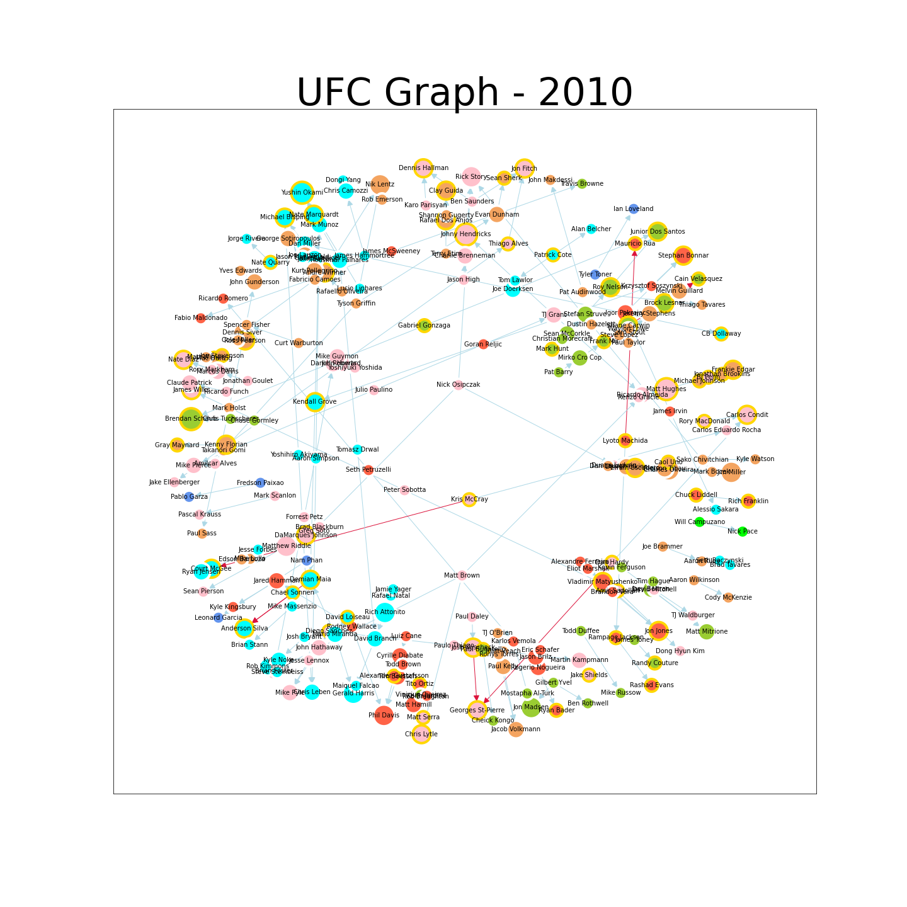

# BD-Final
*Trabalho final da disciplina de Banco de Dados 2020.2*

O objetivo do trabalho é, através de um banco de dados relacional, construir visualizações em grafo após criar uma estrutura não relacional desse conjunto.

## Alunos

> ↳ [Germano Andrade](https://github.com/GermanoAndrade)  
> ↳ [João Alcindo Ribeiro](https://github.com/joao-alcindo) 

## Base de dados
A base escolhida foi de lutas de UFC do Kaggle:  

## Representação
O banco de dados está representado da seguinte forma:  

## Bibliotecas utilizadas

Além de bibliotecas como `numpy` e `pandas` para manipulação de dataframes, foram utilizadas biliotecas como 
`sqlite3` para conexão com o banco de dados (que está armazenado em SQLite), `networkx` para construção do grafo, `pyvis` e `matplotlib` para gerar a visualização do grafo como desejado.

> OBS.: todas as bibliotecas citadas podem ser instaladas rodando `pip install <nome_biblioteca>`

## Aplicabilidade

Grafos em geral são utilizados para análise de relações entre indivíduos ou objetos. Atualmente, são bastante utilizados para analisar relações e/ou interações dentro de redes sociais ou até mesmo interação entre partículas ou células.

## Resultados

